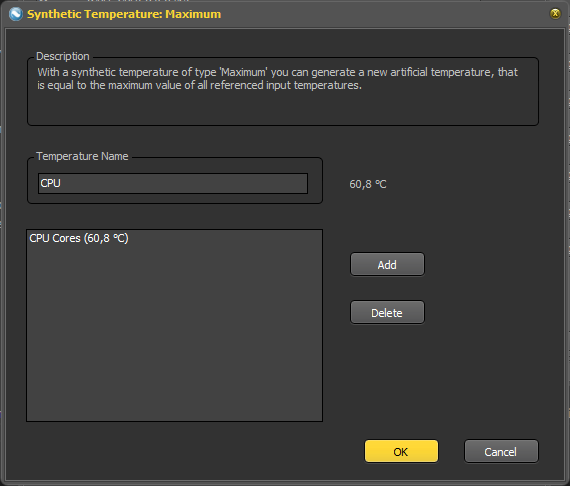

Integrates PC hardware metrics into [MoBro](https://mobro.app) made available
by [ArgusMonitor](https://www.argusmonitor.com/index.php?language=en).

# Disclaimer

This plugin is created and maintained by Zeanon and is not associated with ArgusMonitor.  
It uses the a custom [ArgusMonitorLink.dll](https://github.com/Zeanon/ArgusMonitorLink) to directly access the metrics read out by ArgusMonitor.

---

# Attention

This plugin is in an alpha state rn, it seems to work well for me but it might still contain bugs, if you find any pls feel free to hit me up on the MoBro Discord (LastZeanon).

---

# Setup

You need to have ArgusMonitor running and enable the Argus Data API in Settings->Stability.

---

# Metrics

All metrics offered by ArgusMonitor are fully integrated and accessible within MoBro.  
This includes data from various devices such as:

- Motherboards
- Intel and AMD processors
- NVIDIA and AMD graphics cards
- HDDs, SSDs, and NVMe drives
- Network cards
- Synthetic Temperatures
- And more...

Small disclaimer: ArgusMonitor somehow doesnt export the CPU-Core temp to the API, easiest solution to get it is to just create a synthetic `max` temperature that only contains CPU-Core 

---

## Settings

This plugin provides the following configurable settings:

| Setting          | Default | Description                                                                                                                                              |
|------------------|---------|----------------------------------------------------------------------------------------------------------------------------------------------------------|
| Update frequency | 1000 ms | The interval (in milliseconds) for reading and updating metrics from shared memory. Lower values allow more frequent updates but may increase CPU usage. |
| Processor        | enabled | Enables monitoring and inclusion of processor (CPU) metrics.                                                                                             |
| Graphics Card    | enabled | Enables monitoring and inclusion of graphics card (GPU) metrics.                                                                                         |
| Memory           | enabled | Enables monitoring and inclusion of memory (RAM) metrics.                                                                                                |
| Motherboard      | enabled | Enables monitoring and inclusion of motherboard metrics.                                                                                                 |
| Drives           | enabled | Enables monitoring and inclusion of drive (HDDs, SSDs, etc.) metrics.                                                                                    |                  |
| Network          | enabled | Enables monitoring and inclusion of network (NIC) metrics.                                                                                               |
| Battery          | enabled | Enables monitoring and inclusion of battery metrics.                                                                                                     |
| Synthetic          | enabled | Enables monitoring and inclusion of Argus Monitor Synthetic temperatures                                                                                                      |
